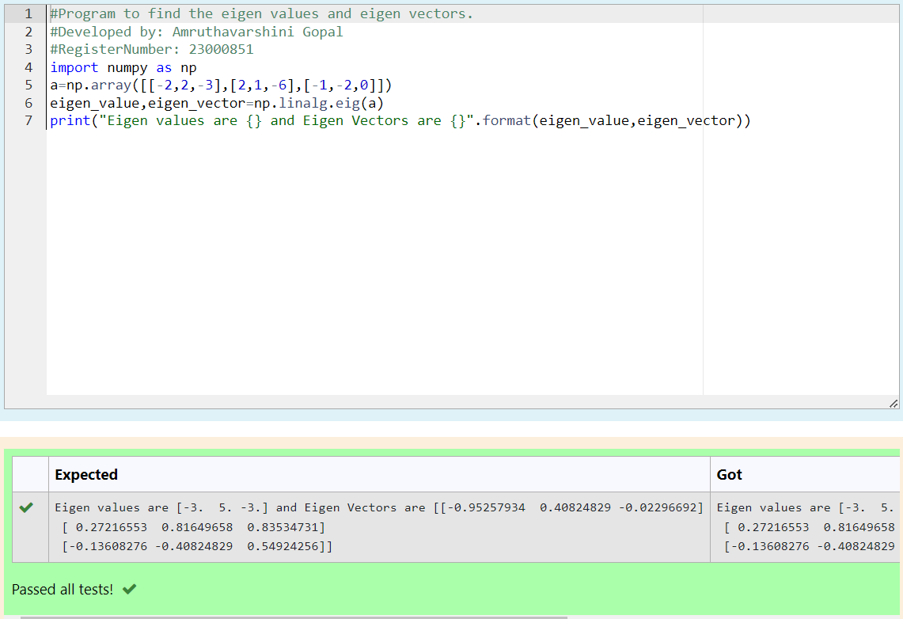

# EIGENVALUES-AND-EIGENVECTORS

## Aim:

To write a python program to find the Eigenvalues and Eigen Vectors

## Equipment’s required:

1. 	Hardware – PCs

2. 	Anaconda – Python 3.7 Installation / Moodle-Code Runner

## Algorithm:

### Step1 : 

Import the numpy module to use the built-in functions for calculation

### Step 2: 

Prepare the lists from the given two dimension matrix and assign in np.array()

### Step 3: 

Using the np.linalg.eig(),  we get two results (first is eigenvalue and second is eigenvector) of the given matrix.

### Step 4: 

Print the result

### Step 5:

End the program

## Program:
```
#Program to find the eigen values and eigen vectors.
#Developed by: Amruthavarshini Gopal
#RegisterNumber: 23000851
import numpy as np
a=np.array([[-2,2,-3],[2,1,-6],[-1,-2,0]])
eigen_value,eigen_vector=np.linalg.eig(a)
print("Eigen values are {} and Eigen Vectors are {}".format(eigen_value,eigen_vector))
```

## Output:



## Result:

Thus the Eigenvalue and Eigenvector is successfully solved using python program
